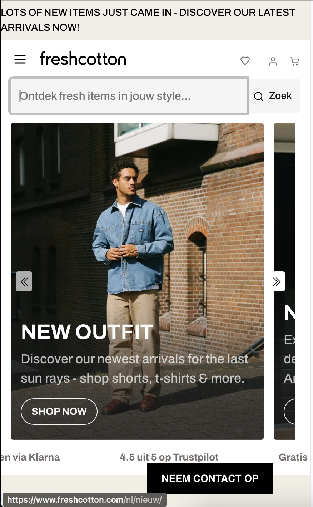
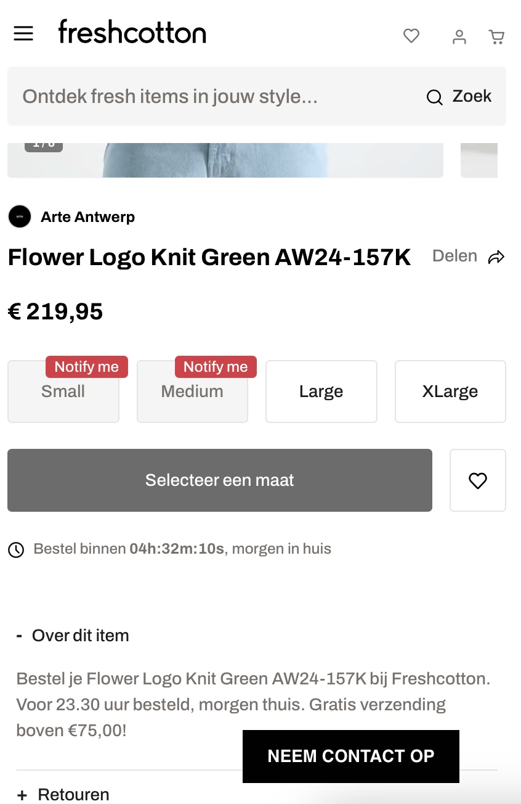
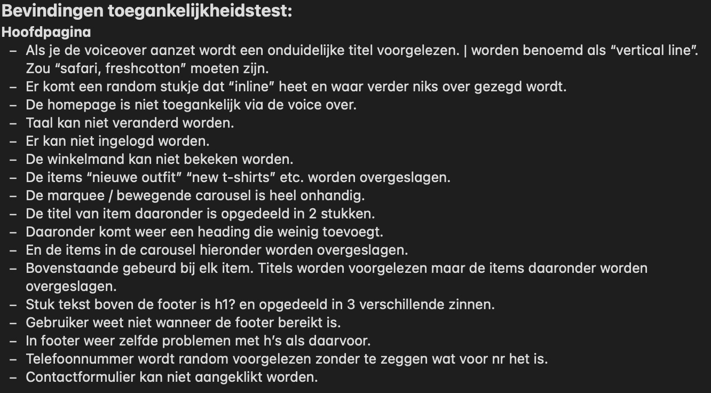
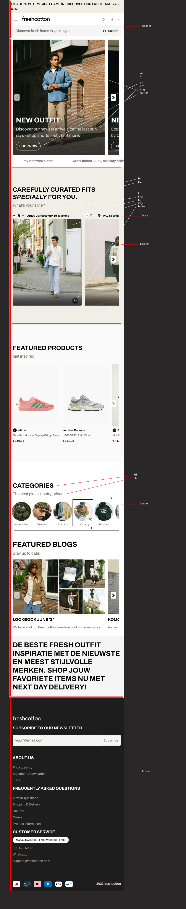
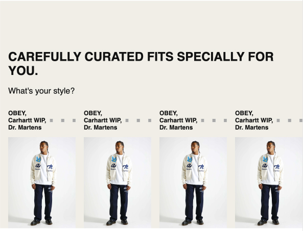
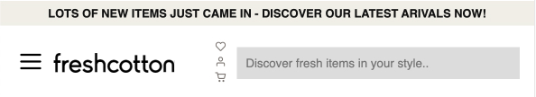
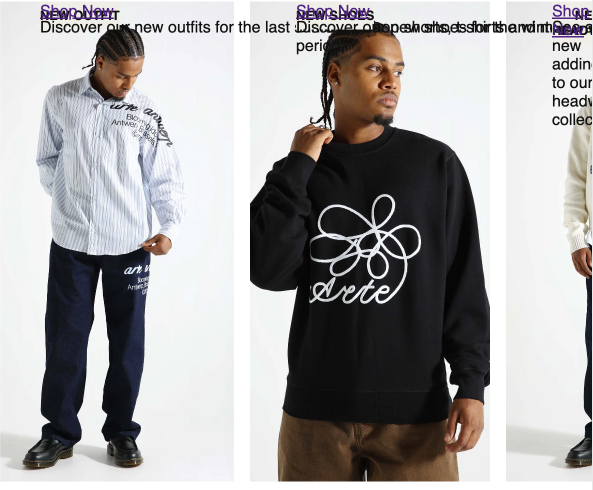

# Procesverslag
Markdown is een simpele manier om HTML te schrijven.  
Markdown cheat cheet: [Hulp bij het schrijven van Markdown](https://github.com/adam-p/markdown-here/wiki/Markdown-Cheatsheet).

Nb. De standaardstructuur en de spartaanse opmaak van de README.md zijn helemaal prima. Het gaat om de inhoud van je procesverslag. Besteedt de tijd voor pracht en praal aan je website.

Nb. Door *open* toe te voegen aan een *details* element kun je deze standaard open zetten. Fijn om dat steeds voor de relevante stuk(ken) te doen.

## Jij

  
uitwerken voor kick-off werkgroep

  ### Auteur:
  Bronger

  #### Je startniveau:
  Blauw

  #### Je focus:
  Responsive
 

## Je website

  
uitwerken voor kick-off werkgroep

  ### Je opdracht:
  www.freshcotton.com

  #### Screenshot(s) van de eerste pagina (small screen): 
  Homepage  
  

  #### Screenshot(s) van de tweede pagina (small screen):
  Praktisch  
  
 

## Toegankelijkheidstest 1/2 (week 1)

  
uitwerken na test in 2e werkgroep

  ### Bevindingen
  Lijst met je bevindingen die in de test naar voren kwamen:
    

## Breakdownschets (week 1)

  
uitwerken na afloop 3e werkgroep

  ### de hele pagina: 
  

  ### dynamisch deel (bijv menu): 
  

  ### wellicht nog een dynamisch deel (bijv filter): 
  

## Voortgang 1 (week 2)

  
uitwerken voor 1e voortgang

  ### Stand van zaken
  Ik ben begonnen met de html en per carousel een voorbeeld gemaakt van hoe een li item eruit zou zien. Hier wilde ik feedback op krijgen.

  ### Agenda voor meeting
  samen met je groepje opstellen

  | student 1      | student 2          | student 3    | student 4        |
  | ---            | ---                | ---          | ---              |
  | dit bespreken  | en dit             | en ik dit    | en dan ik dat    |
  | en dat ook nog | dit als er tijd is | nog een punt | dit wil ik zeker |
  | ...            | ...                | ...          | ...              |

  ### Verslag van meeting
  hier na afloop snel de uitkomsten van de meeting vastleggen

- Taal bovenin naar nederlands
<!-- - <h2 lang=nl> -->
- Nav hoeft geen lijst
- link is navigeren
- Button is actie
- Heel veel aria’s
- elke sectie beginnen met h2 als deze niet zichtbaar is verstoppen met onderstaande
- a11y voor visually hidden om iets te verstoppen mag class gebruiken in h2: class: “.visually-hidden
- mdn website voor tips

## Voortgang 2 (week 3)

  
uitwerken voor 2e voortgang

  ### Stand van zaken
  Ik was inmiddels begonnen met de css maar nog niet heel ver omdat ik veel vastliep. Het leek of elke manier waarop ik hulp zocht (google / studentassistenten) een andere oplossing gaf voor mijn problemen. 

  ### Agenda voor meeting
  samen met je groepje opstellen

  | student 1      | student 2          | student 3    | student 4        |
  | ---            | ---                | ---          | ---              |
  | dit bespreken  | en dit             | en ik dit    | en dan ik dat    |
  | en dat ook nog | dit als er tijd is | nog een punt | dit wil ik zeker |
  | ...            | ...                | ...          | ...              |

  ### Verslag van meeting
  hier na afloop snel de uitkomsten van de meeting vastleggen

- Spiekbriefje in werkcollege 4 slides
- Kopjes //* zijn handig
- Kan ergens bijzetten wat het is als het ingewikkeld is
- display: block; om element eigen regel te geven
- Positioneren likeknop/tekst etc childs in parent positioneren onder:
- position:absolute;
- right:1em
- bottom:1em
- Position:sticky; voor header/nav
- position:fixed; voor livechat knopje
- Gradient met grid maken

## Toegankelijkheidstest 2/2 (week 4)

  
uitwerken na test in 9e werkgroep

  ### Bevindingen
  Lijst met je bevindingen die in de test naar voren kwamen (geef ook aan wat er verbeterd is):

- lang attribuut is er nu wel
- er is een h1 titel voor de pagina
- de headings kloppen
- de list elementen kloppen
- de afbeeldingen hebben een alt attribuut
- a element gebruikt voor links
- controls hebben nog geen focus states
- button gebruikt waar button nodig is
- dark mode supported
- kleurcontrast 13.84
- kleurcontrast goedgekeurd voor elke grootte

## Voortgang 3 (week 4)

  
uitwerken voor 3e voortgang

  ### Stand van zaken
  hier dit ging goed & dit was lastig (neem ook screenshots op van delen van je website en code)

  ### Agenda voor meeting
  samen met je groepje opstellen

  | student 1      | student 2          | student 3    | student 4        |
  | ---            | ---                | ---          | ---              |
  | dit bespreken  | en dit             | en ik dit    | en dan ik dat    |
  | en dat ook nog | dit als er tijd is | nog een punt | dit wil ik zeker |
  | ...            | ...                | ...          | ...              |

  ### Verslag van meeting
  hier na afloop snel de uitkomsten van de meeting vastleggen

  - punt 1
  - punt 2
  - nog een punt
  - ...

## Eindgesprek (week 5)

  
uitwerken voor eindgesprek

  ### Je uitkomst - karakteristiek screenshots:
  

  ### Dit ging goed/Heb ik geleerd: 
  Ik begon met een redelijke achterstand omdat de laatste keer dat ik had gecodeerd lang geleden was. Ik heb het gevoel dat ik de basis pas tijdens dit vak echt heb geleerd wat betreft html, css en javascript (hiermee doel ik op bijv. selectors of wat echt semantische code is zonder classes en weinig divs.).
  Hoewel de uitwerking verre van perfect is heb ik veel geleerd over grid en flexbox (foto's). Ik kan denk ik goed vertellen wat er anders zou moeten en met welke code dit zou moeten, niet alles staat in mijn website maar ik heb wel alle opdrachten gemaakt tijdens de lessen. 

  
  

  ### Dit was lastig/Is niet gelukt:
  Ik zou bij veel fouten op dit moment niet precies kunnen zeggen waar het fout gaat met bijvoorbeeld de eerste carousel. Het is een ul met li elementen alleen scrollen alleen de foto's en de rest van de li inhoud beweegt niet mee. 

  Een ander punt waardoor veel niet is gelukt is hoe een grid precies werkt. Ik snap het concept van rows en columns door de opdracht in een college maar weet niet goed hoe ik hier de formaten van aan kan passen en hoe ik bijvoorbeeld een afbeelding op maat krijg zodat deze het hele li element dekt. Ik heb hiervoor geprobeerd de afbeelding alle columns en rows te laten bedekken of de afbeelding als achtergrond in te stellen maar niks leek te werken. 

  Tot slot vind ik het jammer dat ik niet ver ben gekomen. Ik heb het idee dat als ik minder vast zou lopen met de grids en flexboxen ik de website met mijn huidige kennis goed responsive zou kunnen maken. Hetzelfde geldt voor de microinteractie, die ik graag had willen maken met de knop in de carousel, en de states. Ik heb het idee dat de opdrachten per onderwerp me uiteindelijk allemaal lukten waardoor het extra frustrerend was dat dit ondanks de veele uren niet in mijn eigen website is gelukt. Hier komt ook bij kijken dat de website 3 weken geleden volledig is veranderd en ik alleen nog maar een screenshot had van de eerste pagina. Hiervoor kon ik het origineel inspecteren wat goed hielp, toen dit niet meer kon merkte ik dat het proces een heel stuk trager ging.

  

## Bronnenlijst

  
continu bijhouden terwijl je werkt

  - https://www.javatpoint.com/how-to-remove-bullet-points-in-css#:~:text=It%20can%20be%20easily%20done,create%20the%20list%20without%20bullets
- https://stackoverflow.com/questions/40559629/how-to-make-a-horizontal-scrolling-carousel-using-flexbox
- https://developer.mozilla.org/en-US/docs/Web/CSS/CSS_scroll_snap/Basic_concepts
- https://stackoverflow.com/questions/646764/using-background-image-for-li
- https://stackoverflow.com/questions/4113965/css-selector-for-text-input-fields
- https://www.digitalocean.com/community/tutorials/how-to-load-and-use-custom-fonts-with-css
- https://css-tricks.com/how-to-section-your-html/
- https://blog.logrocket.com/css-flexbox-vs-css-grid/
- https://www.w3schools.com/css/css_selectors.asp
- https://developer.mozilla.org/en-US/docs/Web/CSS/flex-direction
- https://developer.mozilla.org/en-US/docs/Web/CSS/@media/prefers-color-scheme
- https://elementor.com/blog/resize-an-image-in-css/?utm_source=google&utm_medium=cpc&utm_campaign=13060922353&utm_term=&lang=&gad_source=1&gclid=Cj0KCQjw05i4BhDiARIsAB_2wfC9JknvA1CdZoihxmyEA6xZ-cdUSSvdDU79z7HWjbUzBaHmY3IsOtcaAsMwEALw_wcB
- https://www.shecodes.io/athena/8553-centering-a-horizontal-list-with-flexbox-in-css#:~:text=To%20center%20a%20horizontal%20list,to%20center%20the%20list%20horizontally
- https://developer.mozilla.org/en-US/docs/Web/CSS/:first-of-type
- https://stackoverflow.com/questions/30208335/removing-body-margin-in-css
- https://www.giraffeacademy.com/web-development/css/styling-search-bar/
- https://developer.mozilla.org/en-US/docs/Web/CSS/CSS_flexible_box_layout/Aligning_items_in_a_flex_container
- https://developer.mozilla.org/en-US/docs/Web/CSS/:first-of-type
- https://stackoverflow.com/questions/21103622/auto-resize-image-in-css-flexbox-layout-and-keeping-aspect-ratio
- https://www.shecodes.io/athena/103773-how-to-uppercase-a-text-on-css#:~:text=To%20uppercase%20text%20in%20CSS,the%20targeted%20element%20to%20uppercase.&text=This%20will%20display%20%22EXAMPLE%20TEXT%22%20in%20uppercase
- https://www.shecodes.io/athena/49403-how-to-put-list-items-next-to-each-other-in-css#google_vignette
- https://www.shecodes.io/athena/8553-centering-a-horizontal-list-with-flexbox-in-css#:~:text=To%20center%20a%20horizontal%20list,to%20center%20the%20list%20horizontally

