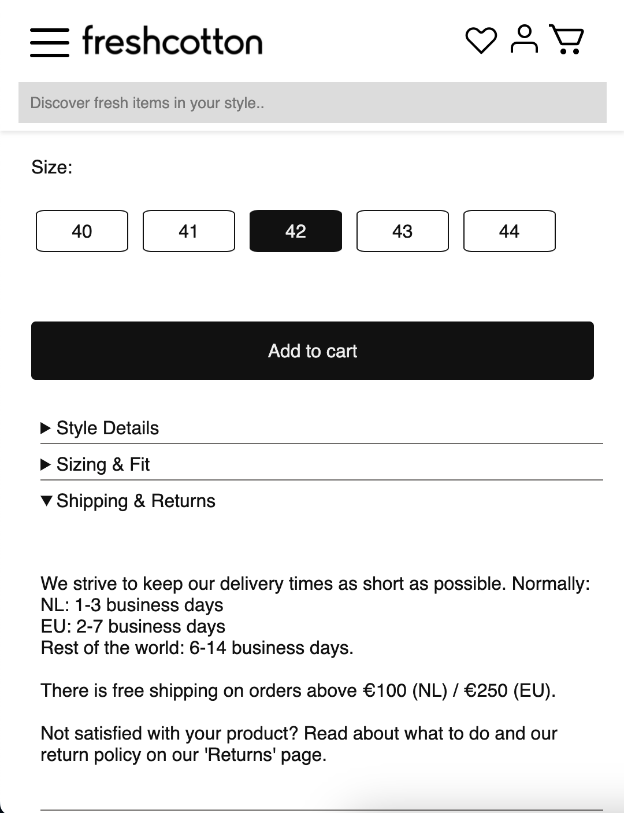
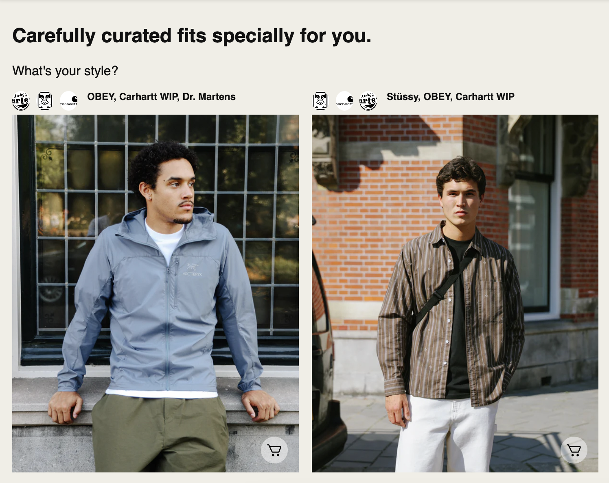
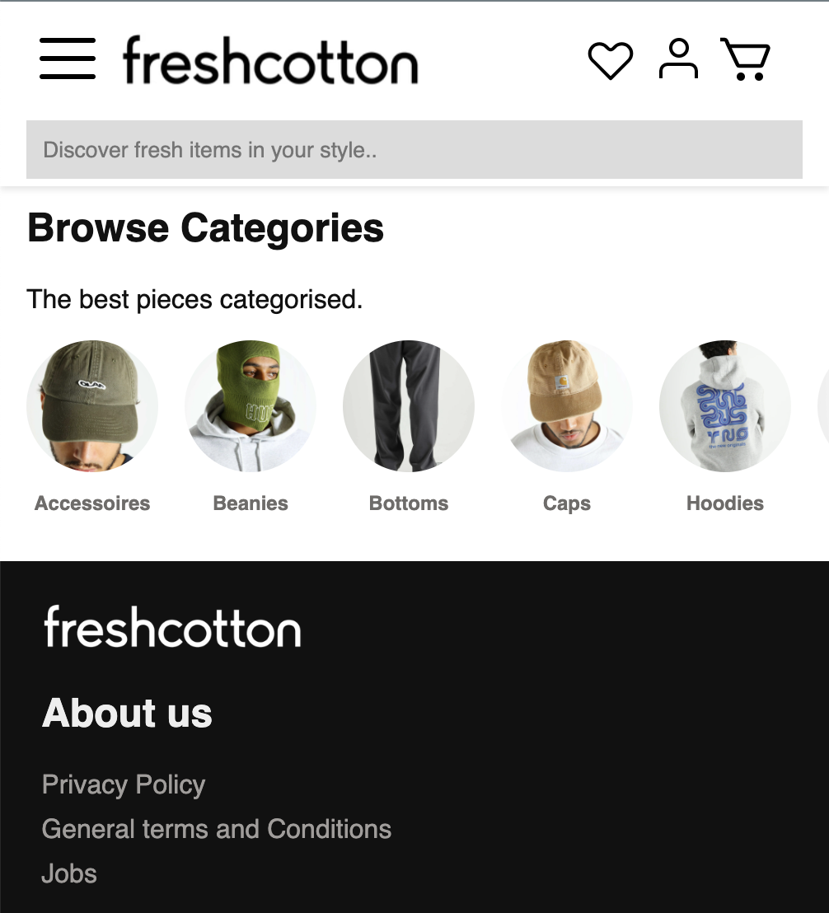

# Procesverslag
Markdown is een simpele manier om HTML te schrijven.  
Markdown cheat cheet: [Hulp bij het schrijven van Markdown](https://github.com/adam-p/markdown-here/wiki/Markdown-Cheatsheet).

Nb. De standaardstructuur en de spartaanse opmaak van de README.md zijn helemaal prima. Het gaat om de inhoud van je procesverslag. Besteedt de tijd voor pracht en praal aan je website.

Nb. Door *open* toe te voegen aan een *details* element kun je deze standaard open zetten. Fijn om dat steeds voor de relevante stuk(ken) te doen.

## Jij

  
uitwerken voor kick-off werkgroep

  ### Auteur:
  Bronger

  #### Je startniveau:
  Blauw

  #### Je focus:
  Responsive
 

## Je website

  
uitwerken voor kick-off werkgroep

  ### Je opdracht:
  www.freshcotton.com

  #### Screenshot(s) van de eerste pagina (small screen): 
  Homepage  
  

  #### Screenshot(s) van de tweede pagina (small screen):
  Praktisch  
  
 

## Toegankelijkheidstest 1/2 (week 1)

  
uitwerken na test in 2e werkgroep

  ### Bevindingen
  Lijst met je bevindingen die in de test naar voren kwamen:
    

## Breakdownschets (week 1)

  
uitwerken na afloop 3e werkgroep

  ### de hele pagina: 
  

  ### dynamisch deel (bijv menu): 
  

  ### wellicht nog een dynamisch deel (bijv filter): 
  

## Voortgang 1 (week 2)

  
uitwerken voor 1e voortgang

  ### Stand van zaken
  Ik ben begonnen met de html en per carousel een voorbeeld gemaakt van hoe een li item eruit zou zien. Hier wilde ik feedback op krijgen.

  ### Verslag van meeting
  hier na afloop snel de uitkomsten van de meeting vastleggen

- Taal bovenin naar nederlands
<!-- - <h2 lang=nl> -->
- Nav hoeft geen lijst
- link is navigeren
- Button is actie
- Heel veel aria’s
- elke sectie beginnen met h2 als deze niet zichtbaar is verstoppen met onderstaande
- a11y voor visually hidden om iets te verstoppen mag class gebruiken in h2: class: “.visually-hidden
- mdn website voor tips

## Voortgang 2 (week 3)

  
uitwerken voor 2e voortgang

  ### Stand van zaken
  Ik was inmiddels begonnen met de css maar nog niet heel ver omdat ik veel vastliep. Het leek of elke manier waarop ik hulp zocht (google / studentassistenten) een andere oplossing gaf voor mijn problemen. 

  ### Verslag van meeting
  hier na afloop snel de uitkomsten van de meeting vastleggen

- Spiekbriefje in werkcollege 4 slides
- Kopjes //* zijn handig
- Kan ergens bijzetten wat het is als het ingewikkeld is
- display: block; om element eigen regel te geven
- Positioneren likeknop/tekst etc childs in parent positioneren onder:
- position:absolute;
- right:1em
- bottom:1em
- Position:sticky; voor header/nav
- position:fixed; voor livechat knopje
- Gradient met grid maken

## Toegankelijkheidstest 2/2 (week 4)

  
uitwerken na test in 9e werkgroep

  ### Bevindingen
  Lijst met je bevindingen die in de test naar voren kwamen (geef ook aan wat er verbeterd is):

- lang attribuut is er nu wel
- er is een h1 titel voor de pagina
- de headings kloppen
- de list elementen kloppen
- de afbeeldingen hebben een alt attribuut
- a element gebruikt voor links
- controls hebben nog geen focus states
- button gebruikt waar button nodig is
- dark mode supported
- kleurcontrast 13.84 / 7.91
- kleurcontrast goedgekeurd voor elke grootte

## Voortgang 3 (week 4)

  
uitwerken voor 3e voortgang

  ### Stand van zaken
  Ik hoopte dat ik het op de een of andere manier zou halen maar het is een heel verduidelijkend voortgangsgesprek geworden. 

  ### Verslag van meeting
      - Veel feedback en uitleg gekregen.
    - voor de carousels grid gebruiken en uittekenen (als je 3 rows hebt zijn er 4 lijnen!!)
    - pseudoelementen gebruiken op knoppen en links
    - div gebruiken op 2e pagina voor responsive om 2 grote elementen naast elkaar te zetten
    - button op li van carousel 2
    - maten voor pagina 2 maken met radiobuttons
    - uitklap tekstjes maken met 
 

    - max content is voor grootte van content zelf (h3 / p) 
    - 1fr is om de overgebleven ruimte te vullen

## Eindgesprek (week 5)

  
uitwerken voor eindgesprek

  ### Je uitkomst - karakteristiek screenshots:

  ### Dit ging goed/Heb ik geleerd: 
  Ik vond het begin van dit vak erg moeilijk omdat mijn laatste keer coderen lang geleden was. Ik ben bij elk college geweest en daar lukte de opdrachten eigenlijk altijd. Thuis zonder studentassistent of hulp in de buurt vond ik het een stuk lastiger. Ik heb veel geleerd over grid en flexbox en hoe je dit kan gebruiken. Ook heb ik mijn css kennis veel uitgebreid met pseudoelementen, animaties en een ontwerp responsive maken. Toen ik eenmaal op dreef was begon ik sommige dingen zelfs leuk te vinden. 

  ### Dit was lastig/Is niet gelukt:
  Ik ben heel blij met het eindresultaat. Het is helaas niet gelukt om de website 100% responsive te maken maar in ruil hiervoor heb ik extra aandacht besteed aan de surface plane. Dit heb ik gedaan door een schaduw toe te voegen aan de header én animaties toe te voegen op de eerste pagina bij de button in de 2e carousel, de li items in de 3e carousel en de add to cart button op de productpagina. Het is jammer dat de eerste carousel en menu niet helemaal responsive is. Ondanks veel dingen te hebben geprobeerd wilde dit niet lukken. Ik denk dat dit, als ik nu vanaf 0 zou beginnen, wel zou lukken dus daar ben ik heel blij mee. Het enige andere wat niet gelukt is zijn de radio buttons die ik maar niet kon stylen met :checked. 

  Tot slot heb ik veel tijd gestoken in iets onderzoeken voor de surface plane. Ik wilde onder de header een border die alles wat daarachter stond zou 'inverten'. Ik heb meerdere dingen geprobeerd waaronder mix-blend-mode: difference; wat ik in een random youtube video vond maar het lukte alleen om de volledige header te inverten wat wel heel onleesbaar zou worden. Achteraf had ik een 
 element toe kunnen voegen aan de header en die op een eigen rij kunnen zetten in de flexbox (of misschien grid van maken). Als ik deze een kleur zou geven en 0 padding en margin zou het denk ik lukken. 

  
  
  

## Bronnenlijst

  
continu bijhouden terwijl je werkt

- https://www.javatpoint.com/how-to-remove-bullet-points-in-css#:~:text=It%20can%20be%20easily%20done,create%20the%20list%20without%20bullets
- https://stackoverflow.com/questions/40559629/how-to-make-a-horizontal-scrolling-carousel-using-flexbox
- https://developer.mozilla.org/en-US/docs/Web/CSS/CSS_scroll_snap/Basic_concepts
- https://stackoverflow.com/questions/646764/using-background-image-for-li
- https://stackoverflow.com/questions/4113965/css-selector-for-text-input-fields
- https://www.digitalocean.com/community/tutorials/how-to-load-and-use-custom-fonts-with-css
- https://css-tricks.com/how-to-section-your-html/
- https://blog.logrocket.com/css-flexbox-vs-css-grid/
- https://www.w3schools.com/css/css_selectors.asp
- https://developer.mozilla.org/en-US/docs/Web/CSS/flex-direction
- https://developer.mozilla.org/en-US/docs/Web/CSS/@media/prefers-color-scheme
- https://elementor.com/blog/resize-an-image-in-css/?utm_source=google&utm_medium=cpc&utm_campaign=13060922353&utm_term=&lang=&gad_source=1&gclid=Cj0KCQjw05i4BhDiARIsAB_2wfC9JknvA1CdZoihxmyEA6xZ-cdUSSvdDU79z7HWjbUzBaHmY3IsOtcaAsMwEALw_wcB
- https://www.shecodes.io/athena/8553-centering-a-horizontal-list-with-flexbox-in-css#:~:text=To%20center%20a%20horizontal%20list,to%20center%20the%20list%20horizontally
- https://developer.mozilla.org/en-US/docs/Web/CSS/:first-of-type
- https://stackoverflow.com/questions/30208335/removing-body-margin-in-css
- https://www.giraffeacademy.com/web-development/css/styling-search-bar/
- https://developer.mozilla.org/en-US/docs/Web/CSS/CSS_flexible_box_layout/Aligning_items_in_a_flex_container
- https://developer.mozilla.org/en-US/docs/Web/CSS/:first-of-type
- https://stackoverflow.com/questions/21103622/auto-resize-image-in-css-flexbox-layout-and-keeping-aspect-ratio
- https://www.shecodes.io/athena/103773-how-to-uppercase-a-text-on-css#:~:text=To%20uppercase%20text%20in%20CSS,the%20targeted%20element%20to%20uppercase.&text=This%20will%20display%20%22EXAMPLE%20TEXT%22%20in%20uppercase
- https://www.shecodes.io/athena/49403-how-to-put-list-items-next-to-each-other-in-css#google_vignette
- https://www.shecodes.io/athena/8553-centering-a-horizontal-list-with-flexbox-in-css#:~:text=To%20center%20a%20horizontal%20list,to%20center%20the%20list%20horizontally
- https://stackoverflow.com/questions/37001555/adding-a-slash-after-just-the-first-link-in-an-ul
- https://developer.mozilla.org/en-US/docs/Web/CSS/clamp 
- https://stackoverflow.com/questions/57547226/how-to-remove-background-from-button
- https://developer.mozilla.org/en-US/docs/Web/CSS/::after
- https://www.youtube.com/watch?v=8P46tFsByAc

